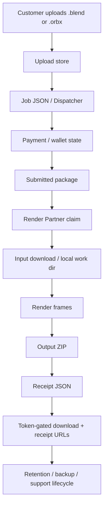

# DATA_FLOW

Status: ACTIVE

Date: 2026-06-30

Mode: Documentation only. No code or production changes.

## Purpose

Trace customer package data through Farpy:

Upload -> Dispatcher -> Render Partner -> Output -> Receipt -> Download -> Retention

This document identifies storage locations, identifiers, hashes, deletion points, and unknowns.

## Source Evidence

Primary implementation files:

- `scripts/job-api.mjs`
- `scripts/render-worker.mjs`

Related audits:

- `release/TRUST_CHAIN_AUDIT_V1.md`
- `release/STATE_MACHINE_AUDIT_V1.md`
- `docs/FARPY_BOOK/INCIDENT_RUNBOOK.md`
- `docs/FARPY_BOOK/TECH_DEBT_REGISTER.md`

## Storage Roots

Farpy uses a configured data directory when `FARPY_WEB_RENDER_DATA_DIR` is set.

If no data directory is configured, local defaults are used:

| Data type | Env override | Default when no data dir |
| --- | --- | --- |
| Jobs | `FARPY_JOB_STORE_DIR` | `.farpy-jobs` |
| Uploads | `FARPY_UPLOAD_STORE_DIR` | `.farpy-uploads` |
| Outputs | `FARPY_OUTPUT_STORE_DIR` | `.farpy-outputs` |
| Receipts | `FARPY_RECEIPT_STORE_DIR` | `.farpy-receipts` |
| Wallet ledger | `FARPY_WALLET_STORE_DIR` | `.farpy-wallet` |
| Work dirs | `FARPY_WORK_DIR` | `.farpy-work` |
| Worker status | `FARPY_WORKER_STATUS_PATH` | `.farpy-worker-status.json` |
| Node pairing | `FARPY_NODE_PAIR_STORE_DIR` / `FARPY_NODE_STORE_DIR` | `.farpy-nodes` |
| BTCPay events | `FARPY_BTCPAY_EVENT_DIR` | `.farpy-btcpay-events` |
| Stripe events | `FARPY_WEB_RENDER_STRIPE_EVENT_DIR` | `.farpy-stripe-events` |
| Ops alert acknowledgements | `FARPY_OPS_ALERT_ACK_PATH` | `.farpy-ops-alert-acks.json` |

Production convention from release docs:

- `/var/lib/farpy-web-render`
- `/var/lib/farpy`

Exact production env values should be verified from systemd env files during recovery.

## End-To-End Flow



## 1. Upload

### What Happens

The customer uploads a `.blend` or `.orbx` package through the web flow or add-on flow. The API stores the raw uploaded file and creates upload metadata.

### Storage Locations

- Upload file: `UPLOAD_DIR`
- Job metadata: `STORE_DIR`

Default local paths:

- `.farpy-uploads`
- `.farpy-jobs`

### Identifiers

- `upload_id`: typically `UP-...`
- `job_id`: typically `JOB-...`
- `download_token`
- `receipt_token`

### Hashes

- Upload/input SHA-256 is stored as `upload.sha256`.
- Receipt later records this as `input_sha256`.

### Deletion Points

- No normal customer self-service upload deletion endpoint is proven.
- Support/account self-service docs list delete uploaded source as a desired future/self-service action, not completed.
- Failed upload may produce failed job/input state, but automatic raw upload deletion was not proven in this audit.

### Unknowns

- Exact production retention duration for raw uploads.
- Whether old uploads are automatically archived or pruned.
- Whether support deletion removes only source upload or also job/receipt/output references.

## 2. Dispatcher

### What Happens

The dispatcher is the backend job state layer. It prices, captures payment/wallet debit, submits paid packages, and exposes claim/lease endpoints to workers or NodeMuncher.

### Storage Locations

- Job JSON: `STORE_DIR/<job_id>.json`
- Wallet ledger: `WALLET_DIR/<sha256(user_id)>.jsonl`
- Stripe events: `STRIPE_EVENT_DIR`
- BTCPay events: `BTCPAY_EVENT_DIR`
- Node pairing records: `NODE_PAIR_STORE_DIR`

### Identifiers

- `job_id`
- `upload_id`
- `user_id`
- hashed wallet ledger filename from `sha256(user_id)`
- Stripe event/session IDs
- BTCPay invoice/event IDs
- `node_id`
- `worker_id`
- `lease_id`

### Hashes

- Wallet ledger filename hashes `user_id` with SHA-256.
- `lease_id` may derive from `sha256(job_id:node_id)` for NodeMuncher.

### Deletion Points

- No normal dispatcher deletion path is proven for job metadata.
- Failure routes remove output/receipt fields from job JSON when marking failed, but this is not the same as deleting stored artifacts.
- Ops alert acknowledgements can mark generated alert IDs resolved, but do not delete incident evidence.

### Unknowns

- Formal retention policy for job JSON.
- Formal deletion/anonymization policy for account deletion.
- Whether all payment/provider event records have a defined retention period.

## 3. Render Partner

### What Happens

A render partner claims or leases an eligible submitted package, downloads/reads the input, renders frames, packages output, and reports complete or fail.

Worker forms:

- Server/legacy render worker.
- Remote authenticated Octane worker.
- NodeMuncher controlled-alpha worker path.

### Storage Locations

- Work directory: `WORK_DIR/<job_id>`
- Work output directory: `WORK_DIR/<job_id>/output`
- Worker status: `WORKER_STATUS_PATH`
- Node pairing/lease state: job JSON and node records.

### Identifiers

- `job_id`
- `upload_id`
- `worker_id`
- `node_id`
- `lease_id`
- `claimed_by`
- `claimed_at`

### Hashes

- Workers may compute `uploaded_sha256` when reading input.
- Final ZIP/output SHA-256 is recorded when output is attached/completed.

### Deletion Points

- Temporary work directories may be safe to prune after jobs are complete/failed, but no formal automatic cleanup policy is proven here.
- Failure routes should avoid marking completion and should not mint receipts.

### Unknowns

- Formal cleanup interval for `WORK_DIR`.
- Whether all remote worker logs are copied back to central storage.
- Whether interrupted remote worker state is always recoverable without operator action.

## 4. Output

### What Happens

Rendered frames and logs are packaged into a ZIP. Completion validation expects required frame files and metadata before accepting a completed package.

Expected ZIP contents may include:

- `manifest.json`
- `job.json`
- `render-log.txt`
- `output/frame_####.png` or equivalent accepted frame outputs

### Storage Locations

- Output ZIP: `OUTPUT_DIR`
- Work output before packaging: `WORK_DIR/<job_id>/output`

Default local path:

- `.farpy-outputs`

### Identifiers

- `output_id`: typically `OUT-...` in some paths.
- `output_filename`
- `job_id`

### Hashes

- `output_sha256`
- Download response exposes `x-farpy-output-sha256` when available.
- Receipt stores `output_sha256`.

### Deletion Points

- No customer self-service completed package deletion endpoint is proven.
- Support docs list delete completed package as a desired action, not an implemented self-service mutation.
- Failed job routes delete output fields from job JSON if no valid delivery exists.

### Unknowns

- Exact production retention duration for completed ZIPs.
- Whether completed ZIP deletion preserves receipt proof or invalidates download links.
- Whether output deletion has an immutable tombstone/state today.

## 5. Receipt

### What Happens

After a valid output exists and `output_sha256` is known, Farpy mints a delivery receipt JSON.

### Storage Locations

- Receipt JSON: `RECEIPT_DIR/<receipt_id>.json`

Default local path:

- `.farpy-receipts`

### Identifiers

- `receipt_id`: typically `RID-...`
- `job_id`
- `upload_id`
- `public_result_url` or workspace/receipt URL fields where applicable

### Hashes

Receipt records:

- `input_sha256`
- `output_sha256`

### Deletion Points

- No normal customer self-service receipt deletion endpoint is proven.
- Failure routes delete receipt fields from job JSON if marking a job failed before valid delivery.
- Receipt JSON deletion after delivery is not defined and should be treated as high risk.

### Unknowns

- Whether receipts are intended to be retained longer than uploads/outputs.
- Whether receipt immutability is enforced beyond route behavior and operational discipline.
- Recovery procedure for receipt/output mismatch remains incomplete.

## 6. Download

### What Happens

The customer downloads the output ZIP through a token-gated endpoint. Receipt JSON is also served through a token-gated endpoint.

### Storage Locations

- Output ZIP: `OUTPUT_DIR`
- Receipt JSON: `RECEIPT_DIR`
- Job JSON with `download_token` and `receipt_token`: `STORE_DIR`

### Identifiers

- `job_id`
- `download_token`
- `receipt_token`
- `receipt_id`

### Hashes

- Download header: `x-farpy-output-sha256`
- Receipt field: `output_sha256`
- Customer can compare local ZIP SHA-256 to receipt/header.

### Deletion Points

- No self-service token revocation path is proven.
- If account history loses tokenized URL, customer may need support to recover access.
- Download artifact deletion is not formally defined in the current source/audits.

### Unknowns

- Token rotation/revocation policy.
- Whether download URLs expire.
- Whether support can safely regenerate access without exposing wrong-user data.

## 7. Retention

### What Is Known

Farpy stores package data in file-backed directories:

- uploads
- jobs
- outputs
- receipts
- wallet ledger
- payment events
- worker/node state
- ops alert acknowledgements

Release and audit docs identify:

- same-host backups
- recovery USB
- planned age-encrypted offsite backup
- Storage Box as encrypted backup destination

### Deletion Points Known Today

| Data | Known deletion/removal behavior |
| --- | --- |
| Job output fields | Failure routes may remove output fields from job JSON. |
| Receipt fields | Failure routes may remove receipt fields from job JSON. |
| Wallet debit | Never deleted; corrected by append-only refund/reversal event. |
| Ops alerts | Acknowledged/resolved by alert ack record, not deleted. |
| Upload source | No proven customer self-service deletion path. |
| Output ZIP | No proven customer self-service deletion path. |
| Receipt JSON | No proven customer self-service deletion path. |

### Unknowns

1. Exact retention duration for uploads.
2. Exact retention duration for outputs.
3. Exact retention duration for receipts.
4. Exact retention duration for job metadata.
5. Account deletion data handling.
6. Package deletion semantics after receipt creation.
7. Whether receipt must remain after source/output deletion.
8. Whether tokenized download/receipt URLs expire.
9. Offsite encrypted backup implementation and restore proof.
10. Backup retention and pruning policy after age encryption is implemented.

## Data Classification

| Data | Sensitivity | Notes |
| --- | --- | --- |
| Uploaded `.blend` / `.orbx` | High | May contain private customer artwork/assets. |
| Output ZIP | High | Customer render result; token-gated. |
| Receipt JSON | Medium/High | Contains job/receipt/payment/render proof; token-gated. |
| Job JSON | High | Contains status, tokens, paths, payment/user references. |
| Wallet ledger | High | Account money history; append-only correction model. |
| Payment events | High | Provider IDs and accounting metadata. |
| Worker status | Medium | Operational capacity and active job data. |
| Public proof/download sidecars | Low | Public-safe by design. |

## Data Flow Risks

| Risk | Impact | Current mitigation | Remaining gap |
| --- | --- | --- | --- |
| Tokenized URL leakage | Private download/receipt exposure | Token-gated routes, unauth job status redaction | URL tokens remain shareable by design. |
| Upload retained longer than expected | Customer privacy concern | Honest policy/docs; support path | Retention duration not formalized here. |
| Output deleted but receipt remains | Broken customer download path | Receipt/download incident runbook | Deletion semantics not formalized. |
| Receipt missing/mismatch | Trust failure | Ops alerts and incident runbook | Recovery path incomplete. |
| Wallet ledger corruption/loss | Money/accounting failure | Append-only ledger and backups | Offsite encrypted restore proof incomplete. |
| Work dirs accumulate | Disk full / privacy | Ops disk alerts | Formal cleanup policy not proven. |

## Recommended Next Actions

1. Define retention durations for upload, output, receipt, job metadata, work dirs, and logs.
2. Define package deletion semantics: source-only delete, output delete, receipt retention, and account deletion.
3. Implement/prove encrypted offsite backup and restore.
4. Add a customer/support runbook for tokenized URL recovery without leaking data.
5. Add a work-dir cleanup policy that never removes active job evidence.
6. Decide whether receipts are immutable long-term records and document that explicitly.

## Commands Run

```powershell
rg -n "DATA_DIR|UPLOAD|OUTPUT|RECEIPT|JOB|WORK|sha256|receipt_id|upload_id|job_id|download_token|receipt_token|retention|delete|unlink|rm|mkdir|writeFile|appendFile|readFile" C:\Users\danki\Desktop\farpy-frontend\scripts\job-api.mjs C:\Users\danki\Desktop\farpy-frontend\scripts\render-worker.mjs -S
```

```powershell
Get-Content -LiteralPath 'C:\Users\danki\Desktop\farpy-frontend\release\TRUST_CHAIN_AUDIT_V1.md' -Raw
Get-Content -LiteralPath 'C:\Users\danki\Desktop\farpy-frontend\release\STATE_MACHINE_AUDIT_V1.md' -Raw
```

Attempted but not found:

```powershell
Get-Content -LiteralPath 'C:\Users\danki\Desktop\farpy-frontend\docs\FARPY_BOOK\STATE_MACHINES.md' -Raw
```
