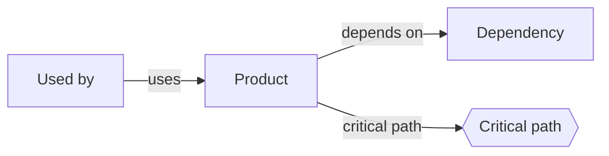
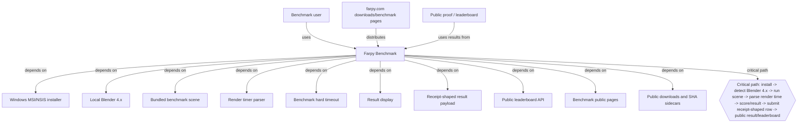
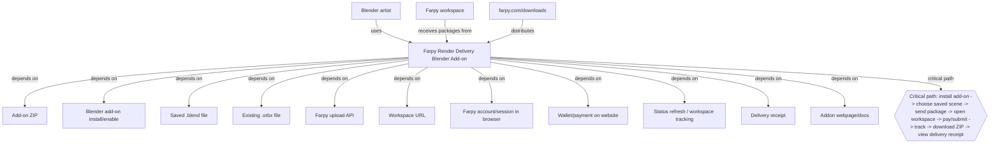
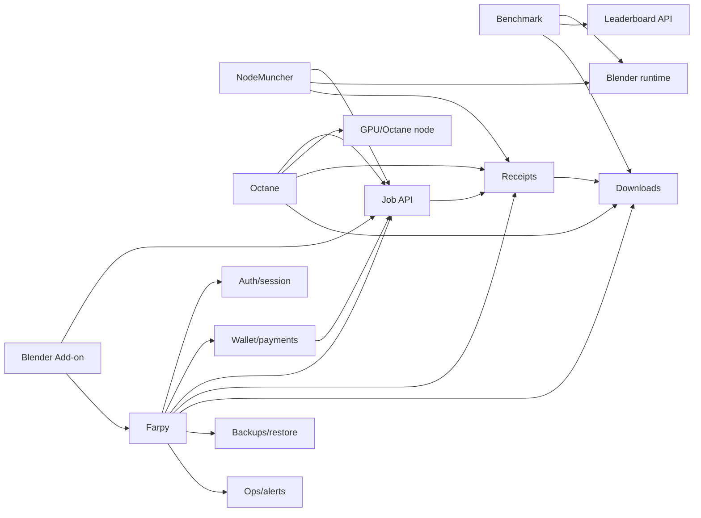

# DEPENDENCY_GRAPH_V1

Status: DOCUMENTED
Date: 2026-06-30
Mode: Documentation only. No code, API, backend, production, or deploy changes.

## Purpose

Show dependency graphs for the current Farpy product set:

- Farpy
- NodeMuncher
- Benchmark
- Blender Add-on
- Octane

Each graph separates:

- depends on
- used by
- critical path

## Legend

## Farpy

Farpy is the customer-facing control plane and retail alpha product. It owns account, wallet, upload, package tracking, receipt/download surfaces, public docs, and the main production experience.

```mermaid
flowchart TD
  Farpy[Farpy customer app]

  Website[farpy.com static frontend]
  Auth[Auth/session]
  Wallet[Wallet ledger]
  Stripe[Stripe card checkout]
  BTCPay[BTCPay Bitcoin on-chain]
  Uploads[Upload storage]
  Jobs[Web-render job API]
  Scheduler[Job state and dispatch]
  Workers[Render partners / workers]
  Outputs[Output ZIP storage]
  Receipts[Delivery receipts]
  Caddy[Caddy reverse proxy]
  Ops[Ops dashboard and alerts]
  Backups[Backups and restore]

  Farpy -->|depends on| Website
  Farpy -->|depends on| Auth
  Farpy -->|depends on| Wallet
  Farpy -->|depends on| Stripe
  Farpy -->|depends on| BTCPay
  Farpy -->|depends on| Uploads
  Farpy -->|depends on| Jobs
  Farpy -->|depends on| Scheduler
  Farpy -->|depends on| Workers
  Farpy -->|depends on| Outputs
  Farpy -->|depends on| Receipts
  Farpy -->|depends on| Caddy
  Farpy -->|depends on| Ops
  Farpy -->|depends on| Backups

  BlenderAddon[Blender Add-on] -->|uses upload/workspace| Farpy
  Benchmark[Benchmark] -->|uses leaderboard/public site| Farpy
  NodeMuncher[NodeMuncher] -->|uses lease/heartbeat/complete APIs| Farpy
  Octane[Octane remote worker] -->|uses worker claim/input/complete APIs| Farpy
  Customer[Customer / Rendar] -->|uses| Farpy

  Critical{{Critical path: sign in -> wallet/top-up -> upload package -> price -> submit -> render partner -> ZIP -> delivery receipt -> download}}
  Farpy -->|critical path| Critical
```

### Farpy Critical Dependencies

- Auth/session must fail closed.
- Wallet and checkout must preserve real balance and ledger state.
- Upload/job APIs must preserve package metadata and private tokens.
- Render partner completion must validate ZIP/frame output before receipt minting.
- Receipt/download URLs must remain token-gated and owner-safe.
- Backups are not on the customer request path, but are critical for survival.

## NodeMuncher

NodeMuncher is the controlled-alpha worker product. It is not broad public launch ready. It depends on Farpy control-plane APIs and a local Blender runtime to claim and execute eligible packages.

```mermaid
flowchart TD
  NM[Farpy NodeMuncher]

  Installer[Windows installer]
  Pairing[Pairing API]
  NodeToken[Persisted node token]
  Heartbeat[Heartbeat endpoint]
  LeasePeek[Lease peek]
  LeaseClaim[Lease claim]
  InputDownload[Claimed input download]
  Blender[Local Blender executable]
  Watchdog[Render watchdog/timeout]
  Zip[Output ZIP packaging]
  Complete[Complete endpoint]
  Fail[Fail endpoint]
  Receipt[Receipt generation]
  Earnings[Earnings/history]
  Logs[Local logs]

  NM -->|depends on| Installer
  NM -->|depends on| Pairing
  NM -->|depends on| NodeToken
  NM -->|depends on| Heartbeat
  NM -->|depends on| LeasePeek
  NM -->|depends on| LeaseClaim
  NM -->|depends on| InputDownload
  NM -->|depends on| Blender
  NM -->|depends on| Watchdog
  NM -->|depends on| Zip
  NM -->|depends on| Complete
  NM -->|depends on| Fail
  NM -->|depends on| Receipt
  NM -->|depends on| Earnings
  NM -->|depends on| Logs

  Farpy[Farpy control plane] -->|uses completed/fail reports from| NM
  Customer[Customer packages] -->|can be rendered by| NM
  Ops[Operator] -->|monitors| NM

  Critical{{Critical path: paired node -> heartbeat green -> lease claim -> input download -> Blender render -> ZIP -> complete/fail report -> receipt/no receipt -> earnings/history}}
  NM -->|critical path| Critical
```

### NodeMuncher Critical Dependencies

- Valid paired node token.
- Header-based auth only; query tokens are forbidden.
- Lease claim must not steal or double-claim packages.
- Blender process must have a hard timeout.
- Failure must report back to production and not strand the package.
- Completion must upload a valid ZIP and must not fabricate earnings or receipts.

## Benchmark

Benchmark is a standalone public desktop utility. It depends on local Blender 4.x and the public leaderboard API. It is separate from NodeMuncher and does not render customer packages.

### Benchmark Critical Dependencies

- Installer must launch without console flash.
- Blender 4.x requirement must be visible and honest.
- Benchmark run must fail with human-readable errors, not strand.
- Leaderboard submission must use real receipt-shaped data only.
- Public downloads must include matching SHA sidecars.

## Blender Add-on

The Blender Add-on is a customer convenience layer for sending `.blend` packages to Farpy. It hands users back to the Farpy workspace for payment, tracking, download, and receipt.

### Blender Add-on Critical Dependencies

- ZIP hash and production download must match.
- Add-on must install and enable in supported Blender versions.
- Upload must be truthful: no fake success.
- Auth/payment should be handled by website workspace unless a real token flow exists.
- Workspace URL should be treated as private when it contains tokens.

## Octane

Octane is the ORBX/headless render path. It depends on the Farpy control plane, authenticated remote worker endpoints, and a licensed GPU node. Public frame policy must remain consistent with what is actually supported.

```mermaid
flowchart TD
  Octane[Octane render path]

  Orbx[.orbx package]
  UploadAPI[Upload API]
  Price[Frame/price validation]
  Submit[Paid submit]
  WorkerClaim[Authenticated worker claim]
  InputDownload[Worker input download]
  OctaneBinary[Licensed Octane binary]
  GPU[GPU node / PR worker]
  FrameRender[Frame rendering]
  ZipPackage[ZIP with manifest/job/render-log/output frames]
  CompleteAPI[Worker complete API]
  FailAPI[Worker fail API]
  Receipt[Delivery receipt]
  Download[Token-gated ZIP download]
  Policy[Public Octane frame policy]

  Octane -->|depends on| Orbx
  Octane -->|depends on| UploadAPI
  Octane -->|depends on| Price
  Octane -->|depends on| Submit
  Octane -->|depends on| WorkerClaim
  Octane -->|depends on| InputDownload
  Octane -->|depends on| OctaneBinary
  Octane -->|depends on| GPU
  Octane -->|depends on| FrameRender
  Octane -->|depends on| ZipPackage
  Octane -->|depends on| CompleteAPI
  Octane -->|depends on| FailAPI
  Octane -->|depends on| Receipt
  Octane -->|depends on| Download
  Octane -->|depends on| Policy

  Customer[ORBX customer] -->|uses| Octane
  Farpy[Farpy control plane] -->|dispatches to| Octane
  Ops[Operator] -->|verifies worker/license| Octane

  Critical{{Critical path: ORBX upload -> payment captured -> remote Octane worker claims -> licensed Octane renders -> ZIP validates -> receipt minted -> download works}}
  Octane -->|critical path| Critical
```

### Octane Critical Dependencies

- Remote GPU node must be reachable and licensed.
- Worker must authenticate with headers and claim only Octane packages.
- ZIP must include `manifest.json`, `job.json`, `render-log.txt`, and deterministic output frames.
- Complete endpoint must reject incomplete frame sets.
- Failed render must not mint receipt and must trigger correct no-delivery payment handling.
- Public still/multi-frame policy must be consistent across homepage/docs/FAQ/add-on/LLM text.

## Cross-Product Dependency Summary

## Critical Path Summary

| Product | Critical Path |
| --- | --- |
| Farpy | Sign in -> wallet/top-up -> upload package -> price -> submit -> render partner -> ZIP -> receipt -> download |
| NodeMuncher | Pair -> heartbeat -> lease claim -> input download -> Blender render -> ZIP -> complete/fail report -> receipt/no receipt -> earnings/history |
| Benchmark | Install -> detect Blender -> run scene -> parse time -> display score -> submit receipt-shaped result -> leaderboard |
| Blender Add-on | Install -> choose saved scene -> send package -> open workspace -> pay/submit -> track -> download -> receipt |
| Octane | ORBX upload -> payment captured -> remote worker claim -> licensed render -> ZIP validation -> receipt -> download |

## Source Release Docs

- [FARPY_V1_FINAL_CHECKLIST.md](../../release/FARPY_V1_FINAL_CHECKLIST.md)
- [CONTROL_PLANE_BOUNDARY_V1.md](../../release/CONTROL_PLANE_BOUNDARY_V1.md)
- [API_CONTRACT_AUDIT_V1.md](../../release/API_CONTRACT_AUDIT_V1.md)
- [STATE_MACHINE_AUDIT_V1.md](../../release/STATE_MACHINE_AUDIT_V1.md)
- [TRUST_CHAIN_AUDIT_V1.md](../../release/TRUST_CHAIN_AUDIT_V1.md)
- [NODEMUNCHER_LEASE_FAILURE_REPORT_V1.md](../../release/NODEMUNCHER_LEASE_FAILURE_REPORT_V1.md)
- [BLENDER_ADDON_FINAL_AUDIT_V1.md](../../release/BLENDER_ADDON_FINAL_AUDIT_V1.md)
- [BENCHMARK_PUBLIC_REPUBLISH_RUNTIME_FIX_V1.md](../../release/BENCHMARK_PUBLIC_REPUBLISH_RUNTIME_FIX_V1.md)
- [OCTANE_READINESS_AUDIT_V1.md](../../release/OCTANE_READINESS_AUDIT_V1.md)

## Notes

These diagrams describe current documented dependencies. They do not create new product promises, fake telemetry, or new operational guarantees.
