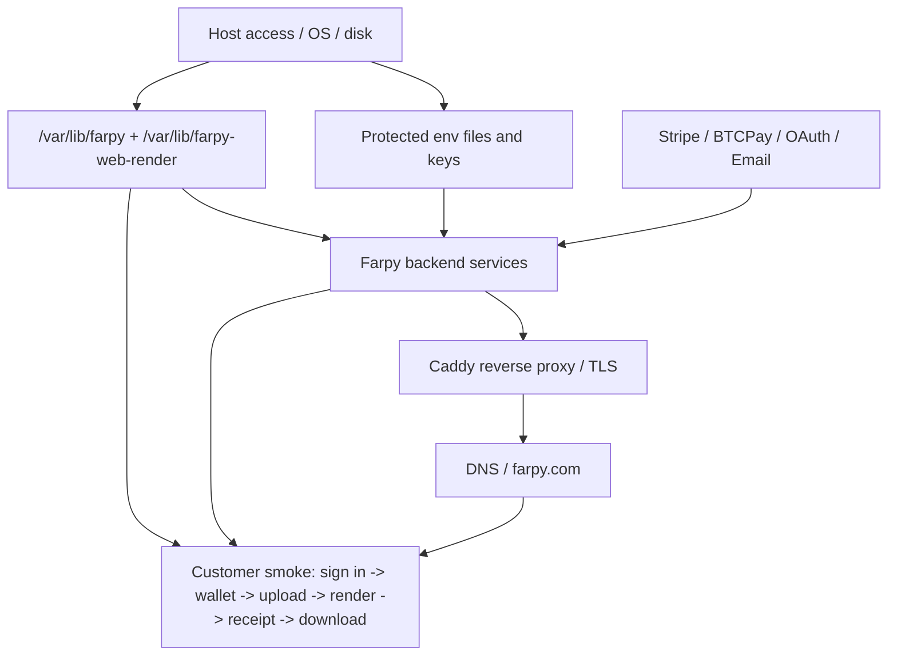

# RESTORE_DEPENDENCY_AUDIT_V1

Status: ACTIVE

Date: 2026-06-30

Mode: Documentation only. No code or production changes.

## Purpose

Audit restore dependencies for Farpy services.

For every service, answer:

- What must exist first?
- What can be verified before DNS cutover?
- What remains unknown or externally dependent?

## Restore Rule

Do not restore public traffic first.

Restore in this order:

1. Host access
2. Secrets/env
3. Storage/data
4. Services
5. Reverse proxy
6. Internal health checks
7. External provider checks
8. DNS/public cutover
9. Customer-flow smoke

## Global Restore Prerequisites

These must exist before most service restores are meaningful.

| Dependency | Required For | Owner | Notes |
|---|---|---|---|
| Host access to restore target | Everything | Infrastructure operator | Node A for same-host restore; Node B for standby/cutover. |
| Root/sudo access | Services, Caddy, env files, restore dirs | Infrastructure operator | Must not depend on founder memory. |
| Source repository or deployment artifact | frontend/backend/service restoration | Release operator | Needed for static output, backend scripts, systemd templates, docs. |
| Protected env files | auth, payments, ops, worker auth | Root / service owner | `/etc/farpy/*` values must be restored without printing secrets. |
| `/var/lib/farpy` | auth/account/wallet-adjacent data | Node A data plane | Exact contents depend on production config. |
| `/var/lib/farpy-web-render` | jobs/uploads/outputs/receipts/wallet/node/payment events | Node A data plane | Critical for customer render continuity and receipts. |
| Caddy config | public ingress and TLS | Caddy operator | Required for public routes, reverse proxy, redirects. |
| DNS/registrar access | public cutover | Domain operator | Required only for external cutover, not local service validation. |
| Stripe dashboard/API access | card topups, webhook replay, refunds | Payment operator | External dependency. |
| BTCPay/Node C access | Bitcoin invoices/webhooks | Payment operator | External dependency. |
| Google OAuth/email provider access | sign-in recovery | Auth operator | External dependency. |
| Backup decryption key | offsite restore | Backup key custodian | Not yet fully proven in docs. |

## Dependency Diagram



## Service Restore Matrix

| Service / Surface | What Must Exist First | Restore/Start Depends On | Verify Before DNS? | External Dependencies | Unknowns |
|---|---|---|---|---|---|
| Static website / frontend | built `out` or static backup; `/opt/farpy.com/out`; Caddy route | host filesystem, static artifact, correct Caddy root | Yes: local file checks and direct host/Caddy checks | DNS only for public access | Timed static rollback objective is unknown. |
| Caddy reverse proxy | Caddy binary/service; config; TLS storage or ability to reissue certs | `/etc/caddy/Caddyfile` or active JSON config; network ports; systemd | Yes: `caddy validate`, local route checks | DNS and ACME/TLS CA for public cert behavior | Cert renewal/emergency runbook incomplete. |
| DNS / domain | registrar/DNS account access | nameservers, zone records, billing/auto-renew | Partially: can inspect provider before cutover | Registrar/DNS provider | Registrar, auto-renew, and second-operator access not proven. |
| Auth/session service | protected auth env; account/session data; Caddy auth routes | `/var/lib/farpy`; auth service unit; OAuth/email config | Yes: local auth health if available | Google OAuth, email provider | OAuth/email provider recovery not fully proven. |
| Google OAuth | auth service restored; OAuth env/client secret; callback routes | provider console config, callback URL, session cookie handling | Partially: `/auth/google?next=` should 302 | Google provider | Provider account recovery not consolidated. |
| Email magic-link | auth service restored; email provider env/config | email provider credentials, sender DNS records | Partially: route can render; delivery requires provider | Email provider, DNS SPF/DKIM/DMARC | Provider and bounce monitoring not fully documented. |
| Web-render API | Node runtime; `scripts/job-api.mjs`; protected env; data dirs | `/opt/farpy-web-render`; `/etc/farpy`; `/var/lib/farpy-web-render`; systemd | Yes: `/health`, fail-closed route probes | Stripe, BTCPay, Caddy for public routes | Timed API restore from backup not proven. |
| Jobs API / dispatcher | web-render API base; jobs dir; wallet dir; upload dir; payment state | job JSON, wallet ledger, event dirs, worker auth env | Yes: no-work/health/status probes | render partners, payment providers | In-flight job reconciliation after restore needs manual policy. |
| Upload API/storage | upload dir; API service; max upload config | `/var/lib/farpy-web-render/uploads`; API route; disk space | Yes: controlled small upload if safe | Caddy/public route for customers | Upload retention/deletion policy unknown. |
| Wallet ledger | wallet dir; account identity; payment event dirs | `/var/lib/farpy-web-render/wallet`; Stripe/BTCPay event records | Yes: ledger/account read-only checks | Stripe/BTCPay for reconciliation | Offsite restore RPO and ledger integrity proof unknown. |
| Stripe/card checkout | web-render API; Stripe env; account/session; wallet ledger | `/etc/farpy/stripe.env`; webhook route; wallet dir | Partially: unauth fail-closed; authenticated checkout needs session/provider | Stripe dashboard/API/webhooks | Second-operator Stripe recovery not proven. |
| Stripe webhook | API running; raw body parsing; webhook secret; event dir | `STRIPE_WEBHOOK_SECRET`; event idempotency store | Yes: unsigned request should fail | Stripe webhook delivery/replay | Replay procedure requires dashboard access. |
| BTCPay Bitcoin checkout | API running; BTCPay env; account/session; wallet ledger | `/etc/farpy/btcpay.env`; Node C reachable; public checkout URL config | Partially: unauth fail-closed; authenticated invoice needs session/BTCPay | BTCPay/Node C | Node C/BTCPay admin recovery not proven. |
| BTCPay webhook | API running; webhook secret; event dir; invoice verification | `BTCPAY_WEBHOOK_SECRET`; `BTCPAY_API_KEY`; BTCPay event dir | Yes: unsigned request should fail | BTCPay API | Store/admin/host restore proof incomplete. |
| Lightning | BTCPay restored; node liquidity/channels; UI flag | BTCPay/Lightning backend | No public restore needed while hidden | Lightning node/channel peers | Public rail intentionally gated. |
| Receipt store | receipt dir; job metadata; token fields | `/var/lib/farpy-web-render/receipts`; job JSON | Yes: known receipt/token route if token available | none beyond API/Caddy | Receipt/output mismatch recovery incomplete. |
| Download store | output dir; job metadata; token fields | `/var/lib/farpy-web-render/outputs`; job JSON | Yes: known tokenized download route if token available | none beyond API/Caddy | Large output offsite restore proof unknown. |
| Worker status / ops alerts | data dir; ops token; API service | worker status file, alert ack path, ops env | Yes: ops summary with token | alert delivery provider/monitor host | Second-recipient alert proof incomplete. |
| Ops dashboard | static frontend; API ops token; ops summary route | `/ops` static page, `FARPY_OPS_TOKEN` | Yes: no-token rejected; token returns summary | none beyond operator access | Token custody/rotation not proven. |
| Blender render worker | Blender binary; worker service; data dirs; jobs dir | `render-worker.mjs`, `BLENDER_EXE`, work/output dirs | Yes: no-work or controlled smoke | local Blender install | Worker capacity recovery time unknown. |
| Remote Octane worker | licensed GPU host; worker script; token; Octane binary | `/opt/farpy-node/web-render-http-worker.py`; worker env; Octane license | Partially: service/claim no-work if host reachable | Octane license/GPU node | PR worker host/license recovery not fully proven. |
| NodeMuncher lease API | node pairing store; node tokens; job store | node records, lease endpoints, auth helpers | Yes: missing/invalid token rejected | paired desktop node | Broad public NodeMuncher still controlled alpha. |
| NodeMuncher desktop | installed app; local node token; Blender path | `%LOCALAPPDATA%\FarpyNode\node.json`; Blender runtime | Yes: local launch/heartbeat | Farpy API, local Blender | Token recovery/update/signing path incomplete. |
| Benchmark public pages/API | static benchmark pages; leaderboard service/data | `/benchmark` static output; leaderboard API/store | Yes: public route/API checks | none for page; Blender only for desktop run | Promotion/signing/update deferred. |
| Benchmark desktop downloads | static `/downloads` artifacts and SHA sidecars | EXE/MSI files, sidecars, downloads page | Yes: HTTP 200 + SHA match | none | Artifact rollback/version manifest partial. |
| Blender Add-on downloads | static ZIP and SHA sidecar | add-on ZIP, sidecar, `/addon` page | Yes: HTTP 200 + SHA match | Blender only for install smoke | Canonical source/package workflow incomplete. |
| Public proof page | static page; public APIs; sidecars | `/proof`, leaderboard, downloads SHA, health endpoints | Yes: route checks | public APIs | Public proof data intentionally thin. |
| Synthetic monitoring | monitor host; script; route list | IONOS/Node B monitor config, alert recipient | Yes: run script manually | alert delivery channel | Alert delivery to second human not proven. |
| Backups | backup source dirs; encryption recipient/key; destination | `/var/lib/farpy*`, `/etc/farpy`, Caddy/systemd config, Storage Box | Yes for same-host tar/sha; offsite not yet proven | Storage Box, decryption key | Full offsite restore and RTO/RPO unknown. |

## Minimal Restore Order For Node A Same-Host Recovery

1. Verify host/disk:
   - OS reachable
   - root/sudo access works
   - disk and inode space available
2. Restore protected configuration:
   - `/etc/farpy`
   - systemd units/drop-ins
   - Caddy config
3. Restore data:
   - `/var/lib/farpy`
   - `/var/lib/farpy-web-render`
4. Restore code/artifacts:
   - `/opt/farpy.com/out`
   - `/opt/farpy-web-render/scripts`
   - worker scripts if local workers run on Node A
5. Reload service manager:
   - `systemctl daemon-reload`
6. Validate Caddy:
   - `caddy validate`
7. Start internal services:
   - auth
   - web-render API
   - jobs/upload/topup/checkout/webhook services
   - leaderboard if needed
8. Start Caddy after upstreams are healthy.
9. Run internal health/fail-closed checks.
10. Run public route checks.
11. Run controlled customer smoke.

## Minimal Restore Order For Node B Cutover

1. Provision Node B with OS/runtime dependencies.
2. Restore source/deploy artifacts.
3. Restore protected env and Caddy/systemd config from encrypted backup.
4. Restore `/var/lib/farpy` and `/var/lib/farpy-web-render` from encrypted offsite backup.
5. Validate checksums.
6. Start services bound to localhost first.
7. Run local API and data integrity checks.
8. Start Caddy on Node B.
9. Verify `Host: farpy.com` routes before DNS cutover if possible.
10. Confirm payment webhooks can be pointed at Node B or remain valid through DNS.
11. Cut DNS only after internal restore is green.
12. Run fresh public route/payment/render/download/receipt smoke.

Gap:

- This cutover has not been fully proven from encrypted offsite backup.

## External Dependency Restore Notes

| External Dependency | Restore Need | Can Farpy Operate Without It? | Notes |
|---|---|---|---|
| DNS/registrar | Required for public traffic to reach restored host | Only internal/direct-host tests work without it | Registrar access is a P1 second-operator gap. |
| Stripe | Required for new card topups and card webhook repair | Existing wallet-funded users may continue if wallet has balance | Dashboard/API recovery is P1. |
| BTCPay/Node C | Required for Bitcoin invoices/webhooks | Card remains available if Stripe works | BTCPay/Node C admin recovery is P1. |
| Google OAuth | Required for Google sign-in | Email magic-link may still work if email works | OAuth provider recovery incomplete. |
| Email provider | Required for magic-link/sign-in/support delivery | Google OAuth may still work if configured | Email provider/DNS docs incomplete. |
| Storage Box | Required for offsite restore | Same-host restore works only if Node A survives | Offsite restore proof is P1. |
| Caddy/ACME/TLS | Required for HTTPS public service | Internal HTTP/upstream tests may work | Cert renewal/reissue runbook incomplete. |

## Restore Dependency Risks

P1:

1. Full host-loss restore depends on offsite encrypted backup, but that proof is not complete.
2. Public cutover depends on registrar/DNS access, which is not proven for a second operator.
3. Payment restoration depends on Stripe/BTCPay dashboards and secrets, which are not fully proven for a second operator.
4. Wallet, jobs, receipts, uploads, and outputs must be restored as a consistent set.
5. In-flight jobs after restore need a written reconcile/fail/retry policy.
6. Receipt/download token recovery depends on preserving both job JSON and receipt/output stores.

P2:

1. Benchmark and add-on artifacts need canonical artifact manifests.
2. Public proof can remain honest but thin after restore.
3. Logs/funnel reporting are useful but not first-order restore blockers.

## Verification Checklist After Restore

Public shell:

- `/`
- `/signin`
- `/account`
- `/topup`
- `/workspace`
- `/receipt`
- `/downloads`
- `/status`
- `/addon`
- `/benchmark`

API:

- `https://api.farpy.com/healthz`
- `https://api.farpy.com/readyz`
- web-render health
- unauth checkout valid JSON -> `401 auth_required`
- malformed checkout JSON -> `400 invalid_json`
- unauth BTCPay invoice -> `401 auth_required`
- unsigned BTCPay webhook -> `400 invalid_signature`
- missing/invalid worker token -> rejected
- ops summary no token -> rejected

Data:

- known wallet ledger readable
- known completed job status safe for unauth
- owner status exposes private URLs only to owner
- known receipt URL works
- known download URL works
- download SHA matches receipt SHA

Operational:

- `systemctl --failed --no-pager` clean
- Caddy active
- API services active
- disk and inode headroom acceptable
- synthetic monitor green
- alert delivery verified

## Related Documents

- `docs/FARPY_BOOK/DEPENDENCY_GRAPH.md`
- `docs/FARPY_BOOK/DATA_FLOW.md`
- `docs/FARPY_BOOK/RTO_RPO.md`
- `docs/FARPY_BOOK/RUNBOOK_STATUS.md`
- `docs/FARPY_BOOK/SECOND_OPERATOR_GAPS.md`
- `docs/FARPY_BOOK/DEPLOYMENT_TIMELINE.md`
- `release/DISASTER_RECOVERY_AUDIT_V1.md`
- `release/FOUNDER_ABSENCE_FIX_V1.md`
- `release/WEB_RENDER_BACKUP_ENCRYPTION_PLAN_V1.md`
- `release/FARPY_INFRA_ROLE_FREEZE_V1.md`
- `release/SINGLE_POINT_OF_FAILURE_AUDIT_V2.md`

## Commands Run

```powershell
Get-Content -LiteralPath 'C:\Users\danki\Desktop\farpy-frontend\docs\FARPY_BOOK\DEPENDENCY_GRAPH.md' -Raw
Get-Content -LiteralPath 'C:\Users\danki\Desktop\farpy-frontend\docs\FARPY_BOOK\DATA_FLOW.md' -Raw
Get-Content -LiteralPath 'C:\Users\danki\Desktop\farpy-frontend\docs\FARPY_BOOK\CONTROL_PLANE_BOUNDARY_V1.md' -Raw
Get-Content -LiteralPath 'C:\Users\danki\Desktop\farpy-frontend\docs\FARPY_BOOK\RTO_RPO.md' -Raw
```

Note:

- `docs/FARPY_BOOK/CONTROL_PLANE_BOUNDARY_V1.md` was not present at that path during this audit. The related control-plane release evidence is referenced instead.

No code changes were made.
No production changes were made.
